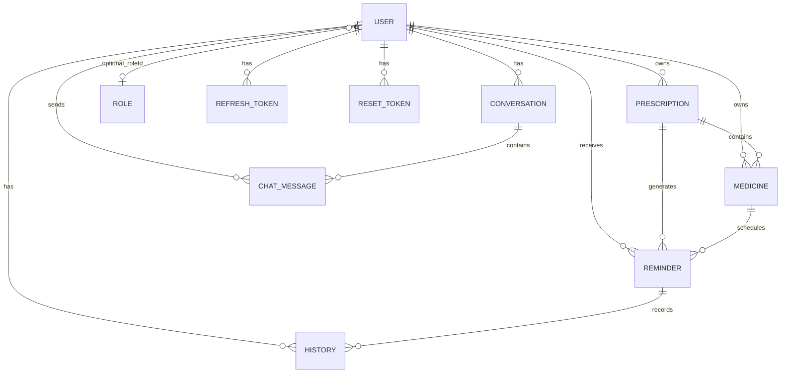

# MediVoice Database Schema

MongoDB via Mongoose. Collection names shown where explicitly set.

---

## Entity Relationship Diagram

---

## `users` (User)

| Field | Type | Required | Default | Notes |
|-------|------|----------|---------|-------|
| `name` | String | Yes | — | Display name |
| `email` | String | Yes | — | Unique |
| `password` | String | Yes | — | bcrypt hash; excluded from `GET /users/me` |
| `roleId` | ObjectId → Role | No | — | RBAC scaffold; optional |
| `createdAt` | Date | Auto | — | timestamps |
| `updatedAt` | Date | Auto | — | timestamps |

**Indexes:** `email` unique (via `@Prop({ unique: true })`)

---

## `refreshtokens` (RefreshToken)

| Field | Type | Required | Notes |
|-------|------|----------|-------|
| `token` | String | Yes | UUID refresh token |
| `userId` | ObjectId | Yes | One per user (upserted) |
| `expiryDate` | Date | Yes | 3 days from issue |
| `createdAt` / `updatedAt` | Date | Auto | timestamps |

---

## `resettokens` (ResetToken)

| Field | Type | Required | Notes |
|-------|------|----------|-------|
| `token` | String | Yes | nanoid(64) |
| `userId` | ObjectId | Yes | |
| `expiryDate` | Date | Yes | 1 hour from issue |
| `createdAt` / `updatedAt` | Date | Auto | timestamps |

---

## `medicines` (Medicine)

| Field | Type | Required | Default | Enum / Notes |
|-------|------|----------|---------|--------------|
| `userId` | ObjectId → User | Yes | — | Owner |
| `prescriptionId` | ObjectId → Prescription | Yes | — | |
| `name` | String | Yes | — | |
| `dosage` | String | No | `''` | Per-dose amount |
| `frequency` | String | Yes | — | `once_daily`, `twice_daily`, `three_times_daily`, `four_times_daily`, `custom` |
| `dosesPerDay` | Number | Yes | — | min 1 |
| `durationDays` | Number | No | `null` | Course length; null = unconfirmed |
| `startDate` | Date | Yes | — | |
| `instructions` | String | No | — | Timing hints for scheduler |
| `createdAt` / `updatedAt` | Date | Auto | — | |

---

## `prescriptions` (Prescription)

| Field | Type | Required | Default | Notes |
|-------|------|----------|---------|-------|
| `userId` | ObjectId | Yes | — | Owner |
| `imageUrl` | String | Yes | — | e.g. `uploads/prescriptions/<uuid>.jpg` |
| `extractedText` | String | No | — | OCR text |
| `doctorName` | String | No | — | |
| `patientName` | String | No | — | |
| `prescriptionDate` | Date | No | — | |
| `status` | String | Yes | `UPLOADED` | `UPLOADED`, `PROCESSING`, `REVIEW_REQUIRED`, `CONFIRMED`, `FAILED` |
| `extractionResult` | Mixed | No | — | Cached review snapshot |
| `createdAt` / `updatedAt` | Date | Auto | — | |

---

## `reminders` (Reminder)

| Field | Type | Required | Default | Enum |
|-------|------|----------|---------|------|
| `userId` | ObjectId | Yes | — | |
| `medicineId` | ObjectId | Yes | — | |
| `prescriptionId` | ObjectId | Yes | — | |
| `shift` | String | Yes | — | `MORNING`, `NOON`, `EVENING`, `NIGHT` |
| `scheduledTime` | Date | Yes | — | |
| `doseNumber` | Number | Yes | — | 1-based per day |
| `dosage` | String | Yes | — | Copied from medicine |
| `status` | String | Yes | `PENDING` | `PENDING`, `TAKEN`, `SKIPPED`, `MISSED` |
| `isActive` | Boolean | Yes | `true` | |
| `createdAt` / `updatedAt` | Date | Auto | — | |

**Unique index:** `{ userId: 1, medicineId: 1, scheduledTime: 1 }`

---

## `histories` (History)

| Field | Type | Required | Enum |
|-------|------|----------|------|
| `userId` | ObjectId | Yes | — |
| `reminderId` | ObjectId | Yes | — |
| `medicineId` | ObjectId | Yes | — |
| `status` | String | Yes | `TAKEN`, `SKIPPED`, `MISSED` |
| `scheduledTime` | Date | Yes | — |
| `actionTime` | Date | Yes | — |
| `createdAt` / `updatedAt` | Date | Auto | — |

---

## `chat_conversations` (Conversation)

| Field | Type | Required | Default |
|-------|------|----------|---------|
| `userId` | ObjectId | Yes | — |
| `title` | String | Yes | `New Conversation` |
| `createdAt` / `updatedAt` | Date | Auto | — |

**Index:** `{ userId: 1, updatedAt: -1 }`

---

## `chat_messages` (ChatMessage)

| Field | Type | Required | Enum |
|-------|------|----------|------|
| `conversationId` | ObjectId | Yes | — |
| `userId` | ObjectId | Yes | — |
| `role` | String | Yes | `user`, `assistant` |
| `content` | String | Yes | — |
| `createdAt` | Date | Auto | — |

**Indexes:** `{ conversationId: 1, createdAt: 1 }`, `{ userId: 1, createdAt: -1 }`

---

## `medicine_database` (MedicineDatabaseEntry)

Indian medicine reference dataset (not user-owned).

| Field | Type | Required | Notes |
|-------|------|----------|-------|
| `externalId` | String | Yes | Unique |
| `name` | String | Yes | |
| `normalizedName` | String | Yes | Search key |
| `price` | Number | No | |
| `isDiscontinued` | Boolean | No | default false |
| `manufacturerName` | String | No | |
| `type` | String | No | |
| `packSizeLabel` | String | No | |
| `compositions` | `[{ raw }]` | No | |
| `substitutes` | String[] | No | |
| `sideEffects` | String[] | No | |
| `uses` | String[] | No | |
| `chemicalClass` | String | No | |
| `habitForming` | String | No | |
| `therapeuticClass` | String | No | |
| `actionClass` | String | No | |
| `source` | String | Yes | default `indian-medicine-dataset` |

**Indexes:** `externalId` unique, `normalizedName`, `manufacturerName`

---

## `roles` (Role) — RBAC scaffold

| Field | Type | Required |
|-------|------|----------|
| `name` | String | Yes |
| `permissions` | Permission[] | Yes |

Permission subdocument:
- `resource`: enum `settings`, `products`, `users`
- `actions`: enum `read`, `create`, `update`, `delete`

**Note:** MediVoice domain routes use `JwtAuthGuard` only; RBAC is not enforced on medicine/prescription/reminder APIs.
