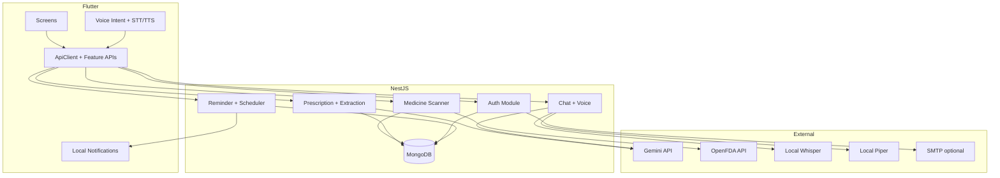

# MediVoice Project Architecture

Audited from repository source code.

---

## High-Level Overview

---

## Backend Stack

| Component | Technology |
|-----------|------------|
| Framework | NestJS ^11 |
| Runtime | Node.js (18+ recommended) |
| Language | TypeScript ^5.7 |
| Database | MongoDB via Mongoose ^9 |
| Auth | JWT (`@nestjs/jwt`) + bcrypt |
| Validation | `class-validator` + global `ValidationPipe` |
| Scheduling | `@nestjs/schedule` (cron every 5 min) |
| OCR | Tesseract.js |
| AI | Google Gemini (`@google/generative-ai`) |
| File upload | Multer via `@nestjs/platform-express` |

**Default port:** `3000` (`process.env.PORT ?? 3000`)

**CORS:** Enabled for `localhost` / `127.0.0.1` origins (Flutter Web).

---

## Backend Module Map

| Module | Path | Purpose |
|--------|------|---------|
| Auth | `src/auth/` | Signup, login, refresh, password reset/change |
| Users | `src/users/` | Profile GET/PATCH |
| Medicine | `src/medicine/` | User medicine CRUD |
| Medicine Scanner | `src/medicine-scanner/` | Barcode/QR + image scan lookup |
| Prescription | `src/prescription/` | Prescription CRUD + upload |
| Extraction | `src/extraction/` | OCR, AI extraction, confirm → medicines + reminders |
| Reminder | `src/reminder/` | Reminder CRUD + generation |
| Scheduler | `src/scheduler/` | Cron: mark overdue reminders MISSED |
| History | `src/history/` | Adherence history + stats |
| Chat | `src/chat/` | Gemini chatbot + voice chat + Piper/Whisper utilities |
| Roles | `src/roles/` | RBAC scaffold (not used on domain routes) |
| OCR | `src/ocr/` | Shared Tesseract wrapper |
| Config | `src/config/` | Environment mapping |
| Guards | `src/guards/` | `AuthenticationGuard`, `JwtAuthGuard`, `AuthorizationGuard` |

---

## Frontend Stack

| Component | Technology |
|-----------|------------|
| Framework | Flutter (Dart SDK ^3.13) |
| HTTP | `http` package + `ApiClient` |
| Auth storage | `flutter_secure_storage` |
| State | StatefulWidget + repositories (no Bloc/Riverpod) |
| Routing | Named routes (`AppRoutes`) |
| Camera | `camera`, `image_picker`, `mobile_scanner` |
| Voice STT/TTS | Backend `/voice/*` + `/chat/voice` |
| Notifications | `flutter_local_notifications` (client-side only) |

---

## Authentication Architecture

1. **Login** → `POST /auth/login` → `{ accessToken, refreshToken, userId }`
2. **Storage** → Flutter `TokenStorage` (secure storage)
3. **Requests** → `Authorization: Bearer <accessToken>`
4. **401** → `POST /auth/refresh` with refresh token → retry once
5. **Access token TTL** → 10 hours (hardcoded in `auth.service.ts`)
6. **Refresh token TTL** → 3 days (DB `expiryDate`)

**No server logout endpoint.** Client clears tokens locally.

---

## Authorization

| Guard | Used On | Behavior |
|-------|---------|----------|
| `JwtAuthGuard` | Most domain controllers | Verifies JWT, sets `request.userId` |
| `AuthenticationGuard` | `change-password`, legacy `/products` | Same JWT verification |
| `AuthorizationGuard` | `/products` only | Checks role permissions (RBAC) |

`@CurrentUser()` decorator reads `userId` from JWT — never trust `userId` in request body for ownership.

---

## Data Flow Summary

| Feature | Backend | Client |
|---------|---------|--------|
| Medicine scan | India DB → OpenFDA → ingredient fallback | Display + TTS `speechSummary` |
| Prescription | Upload → OCR/Gemini → review → confirm | Review screen → confirm |
| Reminders | Generated on confirm; cron marks MISSED | Fetch today → schedule local notifications |
| Chat | Gemini + safety classifier | Text/voice UI |
| Voice UI | Piper TTS, Whisper STT | Intent parser in Flutter |

---

## Notifications Split

| Layer | Responsibility |
|-------|----------------|
| **Backend** | Stores `Reminder.scheduledTime`; cron sets `MISSED` |
| **Flutter** | `ReminderNotificationService` schedules OS notifications from pending reminders |

**No server push notifications** in current implementation.
