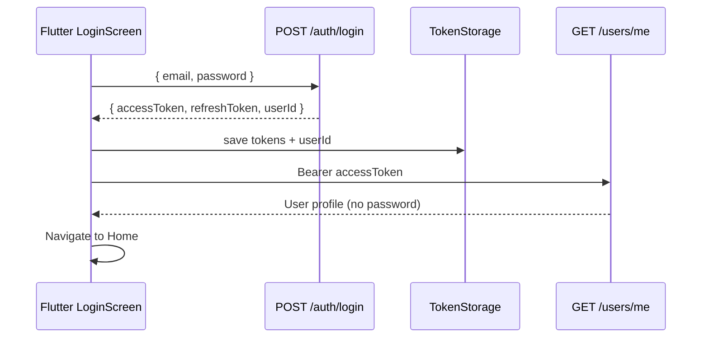
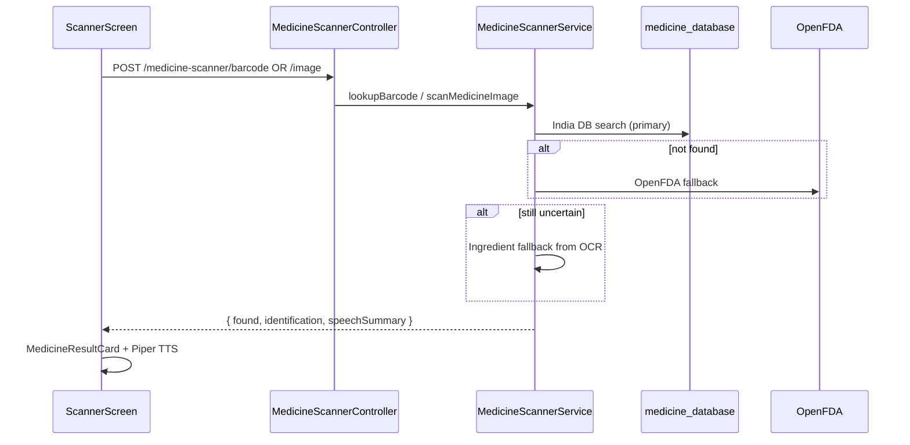
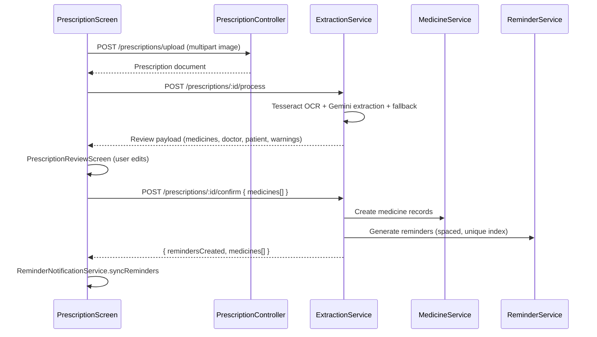
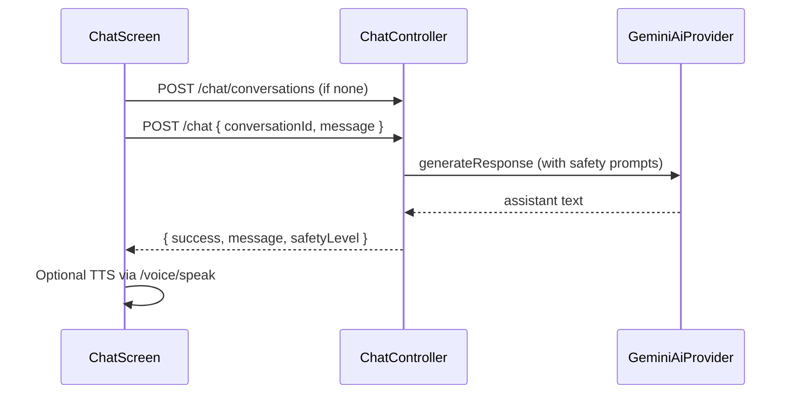

# MediVoice End-to-End Workflows

Verified against source code (`backend/src/`, `frontend/lib/`).

---

## Workflow 1 — Login & Session

**On app restart:** `AuthRepository.restoreSession()` → `GET /users/me` (auto-refresh on 401).

**Logout:** `TokenStorage.clearAll()` — no backend call.

---

## Workflow 2 — Medicine Scan

**Flutter paths:**
- Barcode/QR: `ScannerApi.scanBarcode`
- Image: `ScannerApi.scanImage` (multipart field `image`)

---

## Workflow 3 — Prescription → Reminders

**Key rule:** `process` does NOT create medicines. Only `confirm` does.

---

## Workflow 4 — Voice Navigation

Handled entirely in Flutter except STT/TTS:

1. User taps mic on Home
2. `VoiceFlowController` records audio
3. `POST /voice/transcribe` (public) → transcript
4. `VoiceIntentParser.parse(transcript)` → intent
5. `HomeScreen.routeForIntent` → navigate
6. `POST /voice/speak` (public) → Piper audio feedback

**Voice auth** (login/signup) uses same `/voice/*` endpoints via `VoiceAuthCoordinator` — optional; UI forms are primary.

---

## Workflow 5 — Chatbot

**Voice chat:** `POST /chat/voice` with multipart `audio` + `conversationId`.

---

## Workflow 6 — Reminder Lifecycle

1. **Creation:** `confirm` prescription or `POST /reminders/generate/medicine/:id`
2. **Display:** `GET /reminders/today` (Flutter RemindersScreen)
3. **Local notify:** `ReminderNotificationService.syncReminders` on load
4. **User action:** `PATCH /reminders/:id/status` with `TAKEN` or `SKIPPED`
5. **History:** Created automatically when status updated (via `HistoryService`)
6. **Overdue:** Backend cron every 5 min → `MISSED` for past pending reminders

---

## Workflow 7 — Forgot / Reset Password

1. `POST /auth/forgot-password` `{ email }` → always `{ message }` (no email enumeration)
2. If user exists: reset token stored (1h expiry); email sent if SMTP configured, else logged server-side
3. `PUT /auth/reset-password` `{ resetToken, newPassword }`
4. Flutter navigates to login

---

## Reminder Scheduling Algorithm (Backend)

Source: `reminder.service.ts`

| dosesPerDay | Times (local server timezone) |
|-------------|-------------------------------|
| 1 | 08:00 |
| 2 | 08:00, +8 hours |
| 3 | 08:00, 14:00, 20:00 |
| 4 | 08:00, 12:00, 16:00, 20:00 |
| 5+ | 08:00 + 4h intervals |

**Instruction override:** If `instructions` contains `morning`, `noon/lunch`, `evening/dinner`, `night/bedtime` → use those slots.

**Multi-medicine spacing:** First dose of each medicine offset by 10-minute slots if collision within 1 minute.

**Unique constraint:** `{ userId, medicineId, scheduledTime }` prevents duplicates.

**Catch-up:** If all slots for today are past, schedules one soon same-day reminder instead of inventing duration.

---

## What Creates History Records

- `PATCH /reminders/:id/status` → `HistoryService.createFromReminder` (when status is TAKEN/SKIPPED/MISSED)
- `POST /history/reminder/:reminderId` → manual history entry (API exists; Flutter uses reminder status patch instead)

---

## Environment Dependencies by Workflow

| Workflow | Required env/services |
|----------|----------------------|
| Auth | `MONGODB_URI`, `JWT_SECRET` |
| Medicine scan | MongoDB + imported `medicine_database` |
| Prescription AI | `GEMINI_API_KEY` (chat module also requires it at startup) |
| Voice STT/TTS | `WHISPER_SERVICE_URL`, `PIPER_EXECUTABLE` + model paths |
| Password reset email | `SMTP_*` (optional) |
